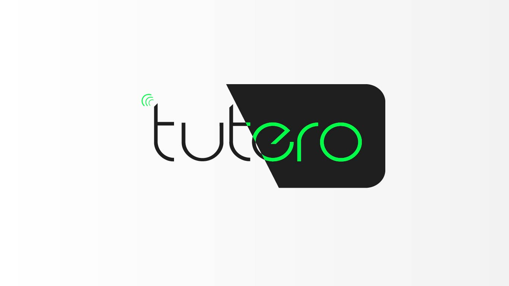
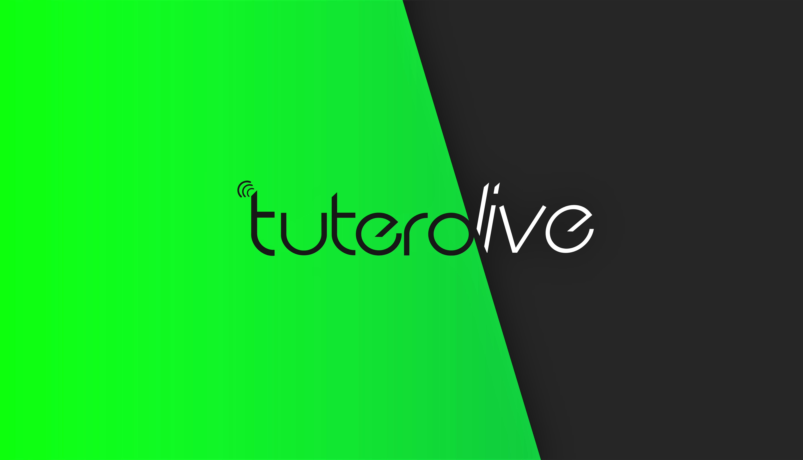

# Tutero - Tutorials On demand

[Intro Video](https://vimeo.com/581803752)

A marketplace where users can find tutors around namibia. This marketplace is integrated with a virtual tutorial platform where tutorials can happen online, thereby breaking down the distance barrier between tutors and tutees.

This repository consists of 2 directories

	- 1. App:  This is the tutero market place
    - 2. Live: This is the virtual tutorial platform

# Tutero App website [here](https://tuteroapp.herokuapp.com/)

# Tutero Live website [here](https://tuterolive.herokuapp.com/)

##  Make sure that you allow tutero live to use your microphone and camera, when the prompt appears.


## TLDR: How to run the development builds(only for development purposes)
### Important: To run the development build on your machine, you will need to install yarn on your machine.

### Tutero 
- Step 1: open the directory ```app``` in the command line/terminal.

- Step 2: once  in the ```app``` directory, run the command ```yarn install```

- Step 3: after the installation is complete, run the command ```npm run dev```
- Step 4: on a seperate command line window/instance, locate to ```tutero/app/client```:
- Step 5: run the command ```yarn install``` again.
- Step 5: once yarn is done installing,  run the command ```npm start```.
- Step 6: Your command line will automatically the application on your default browser, if it does not, visit ```localhost:3000``` on your browser.

(The development builds run on the same port, so to avoid conflicts, run the two dev builds at seperate times/machines)

### Tutero Live 
- Step 1: open the directory ```live``` in the command line/terminal.

- Step 2: once  in the ```live``` directory, run the command ```yarn install```

- Step 3: after the installation is complete, run the command ```npm run dev```
- Step 4: on a seperate command line window/instance, locate to ```tutero/live/client```:
- Step 5: run the command ```yarn install``` again.
- Step 5: once yarn is done installing,  run the command ```npm start```.
- Step 6: Your command line will automatically the application on your default browser, if it does not, visit ```localhost:3000``` on your browser.
- Step 7: Make sure that you allow tutero live to use your microphone and camera, when the prompt appears.


# Tutero


## Description
A marketplace where users can find tutors around namibia. This marketplace is integrated with a virtual tutorial platform where tutorials can happen online, thereby breaking down the distance barrier.

## <ins>How it works</ins> 
Tutor Signs up to be listed on the app,
They put in their subjects and their rate

User can search for a tutor by subject and request a tutorial from a tutor. The tutorial request will include the requested subject and 
Requested time and date

This request is sent to the tutor. The tutor can accept, or decline the request depending on availability. They can also send a direct message(DM) to the tutee to discuss and reschedule.

When the tutorial request is accepted, a room link will be generated. This is the link to tutero live where the tutorial can take place virtually. This link is sent to both the tutee and tutor.

The tutee and tutor visit the room link(the links must be the same) on the desktop browser. The meeting will then begin on tutero live


## Technologies used
React, WebRTC, simple-peer, socket.io, node.js, express, youtube data api, youtube iFrame api, recordRTC, streamsaver.

## Notable:
This project works best on Google chrome or any chromium based browser (Microsoft Edge). Tutero Live does not work on mobile devices.


# Tutero Live


## Description
A Video chat web app for online tutorials and even pair study sessions. This app comes with additional tools for collaboration on top of video chat.

## How to use Tutero Live
Step 1: Press The "Go live" button
Step 2: When the loading icon shows, copy the current browser link and open it on another browser tab, or give it to a friend to open it using another machine's browser
Step 3: Once the other tab or your friend's machine opens the link, the online meeting/session will begin

## Important !!!
This project works best on Google chrome or any chromium based browser (Microsoft Edge). Tutero Live does not work on mobile devices.
For the YTshare feature, make sure to use the green controls under the video player, so that you and your peer's videos are in sync.

## <ins>Features</ins> 
  - LiveChat:  Direct messaging between the peers
  - FileSHare:  File Sharing between the peers
  - LiveCanvas: A collaborative canvas/board with which the two peers can interact(draw, brainstorm).
  - YTShare: Where the peers can watch the same youtube video in sync

## Technologies used
React, WebRTC, simple-peer, socket.io, node.js, express, youtube data api, youtube iFrame api, recordRTC, streamsaver.
